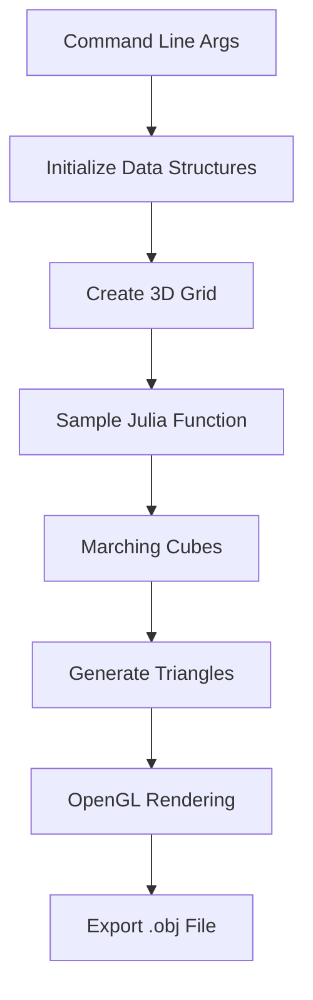

# 🌌 Morphosis: 4D Julia Fractal Visualizer

*A C/OpenGL project that generates and renders beautiful 4D Julia fractals using marching cubes algorithm*

## 🤔 What is this project?

This is **NOT** a JavaScript project! 😅 It's a C program that creates stunning 3D visualizations of 4-dimensional Julia fractals. Think of it as a mathematical art generator that:

1. **Generates 4D Julia fractals** using complex quaternion mathematics
2. **Converts them to 3D meshes** using the marching cubes algorithm
3. **Renders them in real-time** using OpenGL with beautiful wireframe visualization
4. **Exports 3D models** as `.obj` files for use in other applications

## 🎯 For JavaScript Developers: What You Need to Know

### The Big Picture
If you're coming from JavaScript/Node.js, here's how to think about this project:

```javascript
// JavaScript equivalent concept:
const fractal = {
  // 4D Julia set parameters (like a complex function)
  julia: {
    c: { x: -0.2, y: 0.8, z: 0.0, w: 0.0 }, // Complex constant
    maxIterations: 6,                        // How deep to calculate
    threshold: 2.0                           // Escape condition
  },

  // 3D space to sample
  bounds: {
    min: { x: -1.5, y: -1.5, z: -1.5 },
    max: { x: 1.5, y: 1.5, z: 1.5 }
  },

  // Resolution (like pixel density)
  stepSize: 0.05
};

// The process:
// 1. Sample 3D space → Generate point cloud
// 2. Apply Julia function → Get fractal values
// 3. Marching cubes → Convert to triangles
// 4. OpenGL rendering → Display wireframe
// 5. Export → Save as .obj file
```

## 🏗️ Project Architecture

### Core Components

```
📁 Project Structure
├── 🧠 srcs/                    # Core logic (like your src/ folder)
│   ├── main.c                 # Entry point (like index.js)
│   ├── point_cloud.c          # Grid generation
│   ├── build_fractal.c        # Fractal computation
│   ├── sample_julia.c         # Julia set mathematics
│   ├── polygonisation.c       # Marching cubes algorithm
│   └── gl_*.c                 # OpenGL rendering
├── 🎨 shaders/                # GPU shaders (like WebGL shaders)
│   ├── vertex.shader          # Vertex transformation
│   └── fragment.shader        # Pixel coloring
├── 📚 includes/               # Headers (like TypeScript definitions)
└── 🔧 Makefile               # Build system (like package.json scripts)
```

### Data Flow



## 🧮 The Mathematics (Simplified for JS Devs)

### 4D Julia Sets
A Julia set is like a complex function that either converges or diverges:

```javascript
// Pseudo-JavaScript for the Julia function
function juliaFunction(z, c, maxIterations) {
  for (let i = 0; i < maxIterations; i++) {
    z = quaternionMultiply(z, z);  // z = z²
    z = quaternionAdd(z, c);       // z = z² + c

    if (quaternionMagnitude(z) > 2.0) {
      return 0; // Escaped (outside the set)
    }
  }
  return 1; // Inside the set
}

// Quaternion operations (4D complex numbers)
function quaternionMultiply(q1, q2) {
  return {
    x: q1.x*q2.x - q1.y*q2.y - q1.z*q2.z - q1.w*q2.w,
    y: q1.x*q2.y + q1.y*q2.x + q1.z*q2.w - q1.w*q2.z,
    z: q1.x*q2.z - q1.y*q2.w + q1.z*q2.x + q1.w*q2.y,
    w: q1.x*q2.w + q1.y*q2.z - q1.z*q2.y + q1.w*q2.x
  };
}
```

### Marching Cubes Algorithm
This converts a 3D scalar field into a mesh:

```javascript
// Conceptual JavaScript equivalent
function marchingCubes(grid, threshold) {
  const triangles = [];

  for (let x = 0; x < grid.length - 1; x++) {
    for (let y = 0; y < grid[x].length - 1; y++) {
      for (let z = 0; z < grid[x][y].length - 1; z++) {
        // Get 8 corner values of current cube
        const cube = getCube(grid, x, y, z);

        // Determine which edges are intersected
        const edgeIndex = calculateEdgeIndex(cube, threshold);

        // Generate triangles based on lookup table
        const cubeTriangles = generateTriangles(cube, edgeIndex);
        triangles.push(...cubeTriangles);
      }
    }
  }

  return triangles;
}
```

## 🚀 How to Run (For Non-C Developers)

### Prerequisites
You'll need these installed (like npm dependencies):

```bash
# macOS (using Homebrew)
brew install glfw glew

# Ubuntu/Debian
sudo apt-get install libglfw3-dev libglew-dev

# Or if you have a package manager, install:
# - GLFW (window management)
# - GLEW (OpenGL extensions)
# - OpenGL development libraries
```

### Building and Running

```bash
# Navigate to project
cd cursor-reverse-hackathon

# Build the project (like npm run build)
make

# Run with default settings (like npm start)
./morphosis -d

# Run with custom parameters
./morphosis 0.05 -0.2 0.8 0.0 0.0
#        ↑     ↑    ↑   ↑   ↑
#    step_size  c.x c.y c.z c.w
```

### Command Line Options

```bash
# Default mode (uses preset values)
./morphosis -d

# Matrix mode (loads parameters from file)
./morphosis -m matrix_file.txt

# Poem mode (loads parameters from poem file)
./morphosis -p poem_file.txt

# Custom mode (manual parameters)
./morphosis <step_size> <c.x> <c.y> <c.z> <c.w>
# Then enter max_iterations when prompted
```

## 🎮 Controls and Interaction

Once the OpenGL window opens:

- **Automatic rotation**: The fractal rotates automatically
- **ESC**: Close the window
- **Export**: The program automatically exports `fractal.obj` when closed

## 📊 Understanding the Output

### Console Output
```
1/60.0    # Progress: processing layer 1 of 60
2/60.0    # Progress: processing layer 2 of 60
...
EXPORTING----
DONE
```

### Generated Files
- `fractal.obj`: 3D model file that can be imported into Blender, Maya, etc.

## 🔧 Key Parameters Explained

### Julia Set Parameters
```c
// In init.c - these control the fractal shape
julia->c.x = -0.2f;    // Real part of complex constant
julia->c.y = 0.8f;     // Imaginary part of complex constant
julia->c.z = 0.0f;     // First quaternion dimension
julia->c.w = 0.0f;     // Second quaternion dimension
julia->max_iter = 6;   // Iteration depth (higher = more detail)
```

### Grid Parameters
```c
// In init.c - these control resolution and bounds
fract->p0 = {-1.5f, -1.5f, -1.5f};  // Minimum bounds
fract->p1 = {1.5f, 1.5f, 1.5f};      // Maximum bounds
fract->step_size = 0.05f;            // Grid resolution
```

## 🐛 Common Issues and Solutions

### Compilation Errors
```bash
# If you get "OpenGL not found"
export PKG_CONFIG_PATH=/usr/local/lib/pkgconfig

# If you get "GLFW not found"
brew install glfw  # macOS
sudo apt-get install libglfw3-dev  # Ubuntu

# If you get "GLEW not found"
brew install glew  # macOS
sudo apt-get install libglew-dev  # Ubuntu
```

### Runtime Issues
- **Black screen**: Check if OpenGL drivers are installed
- **No rotation**: The fractal should rotate automatically
- **No export**: Check file permissions in the directory

## 🎨 Customization Ideas

### For JavaScript Developers
If you want to modify this project:

1. **Change colors**: Edit `shaders/fragment.shader`
2. **Modify fractal parameters**: Edit `srcs/init.c`
3. **Add new fractal types**: Create new functions in `srcs/sample_julia.c`
4. **Change rendering style**: Modify `srcs/gl_draw.c`

### Example: Changing the Color
```glsl
// In shaders/fragment.shader
void main() {
    // Change this line to modify the color
    color = vec4(1.0f, 0.0f, 0.0f, 1.0f); // Red instead of gold
}
```

## 🔬 Technical Deep Dive

### Memory Management
Unlike JavaScript's garbage collection, this C program manually manages memory:

```c
// Allocate memory (like new Array() in JS)
data->vertexpos = (float3 *)malloc(size * sizeof(float3));

// Free memory (automatic in JS, manual in C)
free(data->vertexpos);
```

### OpenGL Pipeline
```c
// 1. Create shader program (like WebGL setup)
makeShaderProgram(gl);

// 2. Create vertex buffer (like gl.createBuffer())
createVBO(gl, size, data);

// 3. Render loop (like requestAnimationFrame())
while (!glfwWindowShouldClose(gl->window)) {
    glDrawArrays(GL_TRIANGLES, 0, gl->num_pts);
    glfwSwapBuffers(gl->window);
}
```

## 🎯 What Makes This Special

1. **4D Mathematics**: Uses quaternions (4D complex numbers) instead of regular complex numbers
2. **Real-time Rendering**: Generates and displays fractals in real-time
3. **Marching Cubes**: Converts mathematical functions into 3D meshes
4. **Export Capability**: Saves results as standard 3D model files

## 🚀 Next Steps

If you're interested in this type of project:

1. **Learn OpenGL**: Similar to WebGL but more powerful
2. **Study Fractal Mathematics**: Julia sets, Mandelbrot sets, etc.
3. **Explore 3D Graphics**: Mesh generation, rendering pipelines
4. **Try WebGL**: Port this to JavaScript using Three.js or raw WebGL

## 📚 Resources

- [OpenGL Tutorial](https://learnopengl.com/)
- [Julia Set Mathematics](https://en.wikipedia.org/wiki/Julia_set)
- [Marching Cubes Algorithm](https://en.wikipedia.org/wiki/Marching_cubes)
- [Quaternion Mathematics](https://en.wikipedia.org/wiki/Quaternion)

---

*Happy fractal exploring! 🌌✨*

*Remember: This is C code, not JavaScript, but the mathematical concepts are universal!*
